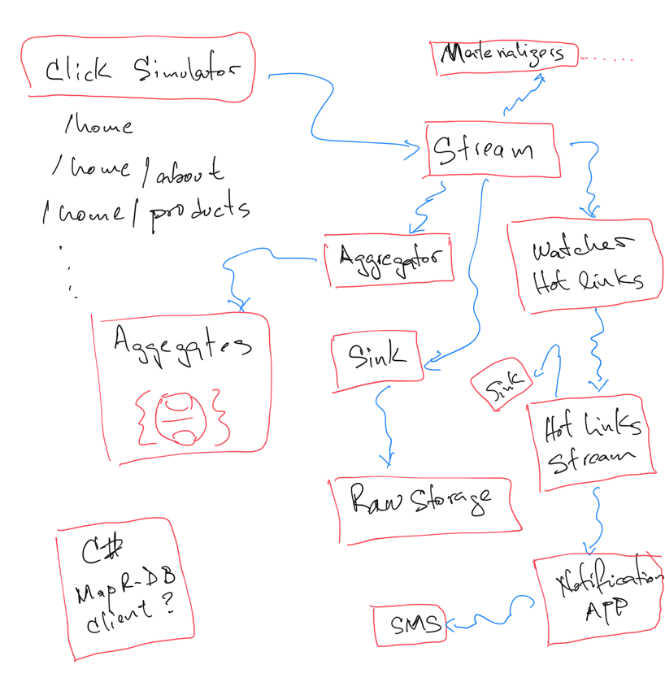

# Reactor

**Reactor** shows how to integrate different technologies with the *MapR Data Platform*. 

## Modules

- [Click Simulator](https://github.com/anicolaspp/reactor/tree/master/clicksimulator) generates and writes links to the system.
- View Materializers
  - [Aggregator](https://github.com/anicolaspp/reactor/tree/master/aggregator) materializes global link stats in time window.
  - [Links General Stats](https://github.com/anicolaspp/reactor/tree/master/links_general_stats) materializes the total counts view for each link.

## Reactor Overview

**Reactor** is built as a compilation of different technologies interacting with each other. The following diagram shows a general overview of these interactions. 

**Reactor** is built again *MapR 6.0.1*
