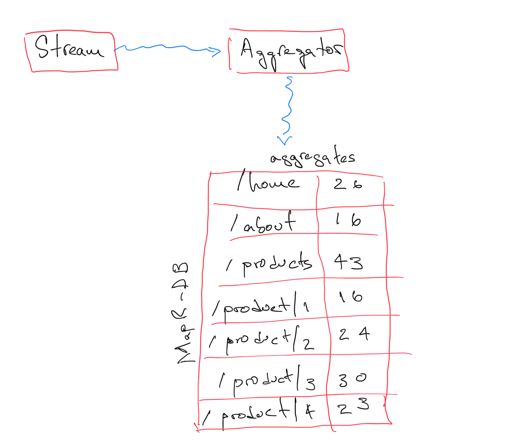

# Aggregator

**Aggregator** is a click stream consumer that runs on top of Apache Spark. It is in charge of counting how many times each link appers in a time window.

The calculated stats are then save to *MapR-DB*.

Use the following command to create an Spark executable.

```shell
sbt assembly 
```

After this, the resultant assembly is ready to be submitted as an Spark Application.

```shell
spark-submit --class "com.github.anicolaspp.aggregator.App" --deploy-mode client aggregator-1.0.0.jar
```

By default, **Aggregator** reads from a *MapR Stream* called **/user/mapr/streams/click_stream:all_links** on the *MapR Cluster* and writes to a *MapR-DB* table called **/user/mapr/tables/link_aggregates**.

The following diagram show the input and output of the process. Notice that the aggregated stats are refreshed every 500 milliseconds. This is a materialized view of the last 500 milliseconds of the system. 



**Aggregator** is one of the many *View Materializer* on the [Reactor Sytem](https://github.com/anicolaspp/reactor/)
