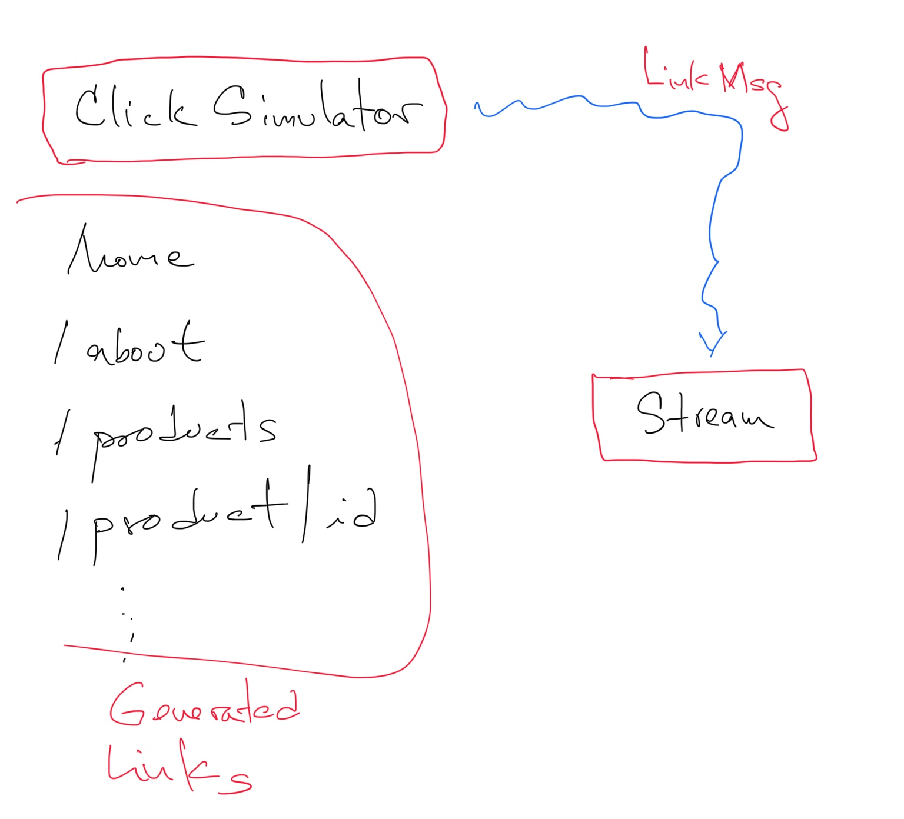

# Click Simulator

**Click Simulator** is a way to simulate traffic on a web site.

The links that are randomly generated are written to **MapR Streams**. 

This application can be executed anywhere where the JVM is available. 

```shell
mvn clean compile
mvn package

java -jar /Users/nperez/IdeaProjects/reactor/clicksimulator/target/clicksimulator-1.0.0-SNAPSHOT.jar
```

Generated links are written to the following `MapR Streams`. 

```
/user/mapr/streams/click_stream:all_links
```

Make sure the stream was created before and the user running app has access to write on it. 

Create the stream with the following command.

```shell
maprcli stream create -path /user/mapr/streams/click_stream:all_links
```

 
