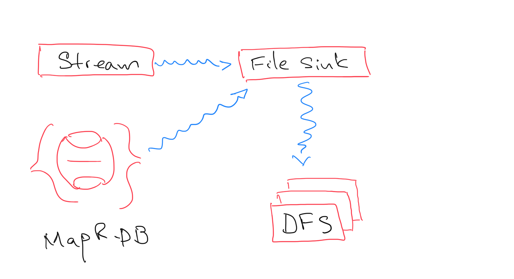

# File Sink

**File Sink** is in charge or reading the message input stream (MapR-ES) and write to MapR-XD every single message. 

MapR-ES is able to save the offsets of the message being read so consumers can use the provided offsets. However, for this particular use case, we are going to commit the offsets to MapR-DB only when the corresponding messages have been written the MapR-XD.

Every time **File Sink** stars, it reads the offsets from MapR-DB and then starts consuming MapR-ES from that point on. In this way, we guarantee that we are not missing any data in MapR-XD.   

At the same time, files written in MapR-XD have not apparent order or relationship. MapR-DB is use has index for the file system. In this way we can read each file on MapR-XD based on a predefined index. 

File on MapR-XD can be re-indexed once a new index is introduced by reading all files and then applying the indexing strategy.      

## General Architecture

