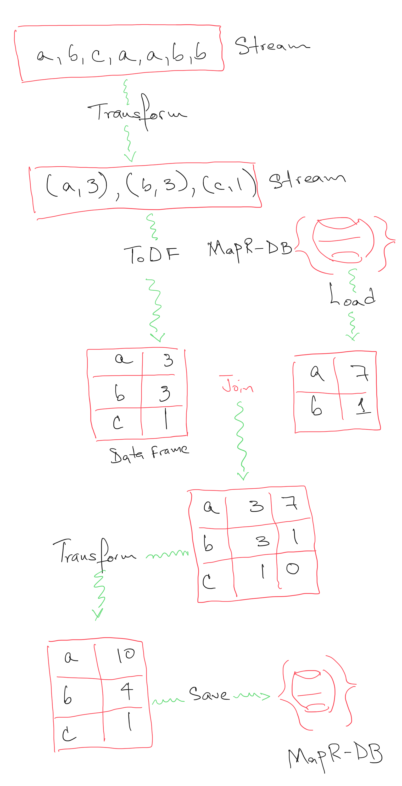

# links_general_stats

**links_general_stats** is an Apache Spark application that calculates the total count for links by combining the input stream and the already existing counts on MapR-DB.

This project shows how to join a live stream of data running on MapR-ES and tables from MapR-DB in order to update the same table. At the same time it solves a complicated issue when async inserts are executed again the table on MapR-DB. Instead of running disjoint inserts, **links_general_stats** generates an updated view of the global counts and then update the data on the MapR-DB table with the calculated global view. 

All the calculation are done on the DataFrame and DataSet APIs since for this particular purpose, working with the RDD API is extremely complex. 

The following image shows how two data flows, one coming from the MapR-ES and the second coming from MapR-DB, join to create the global view that is then save back the MapR-DB.

